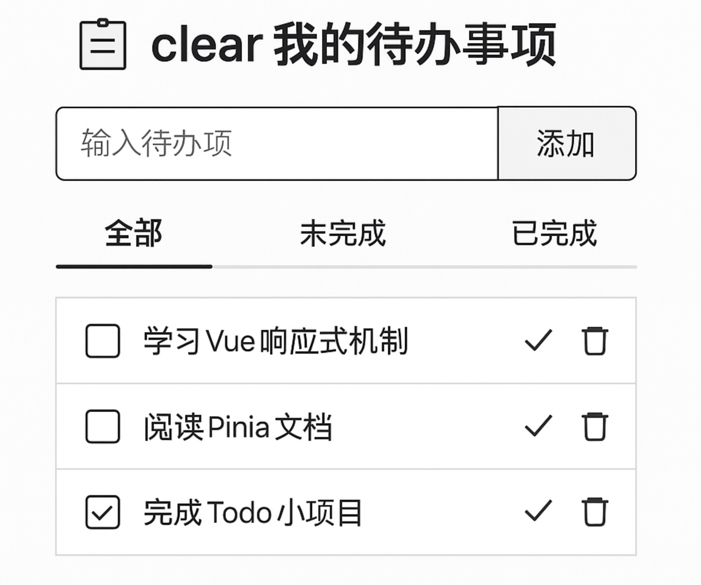

当然可以！  
我明白了：  
你想要一版**真正符合Vue3标准组合式API规范**，  
**又结合了Pinia**的，  
**功能小巧但写法严谨的标准参考代码**，  
这样可以直接学习+仿写，少走弯路。

好的，我给你出一版完整的最小标准参考项目结构，  
包括：  
- Pinia store
- App.vue 主入口
- TaskList 子组件
- main.js 注册

写法上保证是**现在企业Vue3+Pinia项目最推荐的标准写法**，适合你直接学习或精简仿写！

---

# 📚 标准版 Todo 小项目参考代码（Vue3 + Pinia + Vite）

---

## 1. `stores/useTodoStore.js`  
（Pinia模块化写法）

```javascript
import { defineStore } from 'pinia'
import { ref, computed } from 'vue'

export const useTodoStore = defineStore('todo', () => {
  const tasks = ref([])

  const unfinishedTasks = computed(() => tasks.value.filter(task => !task.done))
  const finishedTasks = computed(() => tasks.value.filter(task => task.done))

  function addTask(text) {
    tasks.value.push({
      id: Date.now(),
      text,
      done: false
    })
  }

  function toggleTask(id) {
    const task = tasks.value.find(t => t.id === id)
    if (task) {
      task.done = !task.done
    }
  }

  function removeTask(id) {
    tasks.value = tasks.value.filter(t => t.id !== id)
  }

  function loadTasks(saved) {
    tasks.value = saved || []
  }

  return {
    tasks,
    unfinishedTasks,
    finishedTasks,
    addTask,
    toggleTask,
    removeTask,
    loadTasks
  }
})
```

---

## 2. `components/TaskList.vue`  
（子组件，渲染任务列表）

```vue
<template>
  <ul>
    <li v-for="task in list" :key="task.id">
      <input type="checkbox" :checked="task.done" @change="toggle(task.id)" />
      <span :style="{ textDecoration: task.done ? 'line-through' : 'none' }">
        {{ task.text }}
      </span>
      <button @click="remove(task.id)">删除</button>
    </li>
  </ul>
</template>

<script setup>
import { defineProps } from 'vue'

const props = defineProps({
  list: Array,
  toggle: Function,
  remove: Function
})
</script>
```

---

## 3. `App.vue`  
（主页面，控制输入和整体逻辑）

```vue
<template>
  <div style="max-width: 400px; margin: 40px auto;">
    <h2>我的待办事项</h2>

    <form @submit.prevent="handleAdd">
      <input v-model="text" placeholder="输入新任务" />
      <button type="submit">添加</button>
    </form>

    <h3>全部任务</h3>
    <TaskList :list="todoStore.tasks" :toggle="todoStore.toggleTask" :remove="todoStore.removeTask" />

    <h3>未完成任务</h3>
    <TaskList :list="todoStore.unfinishedTasks" :toggle="todoStore.toggleTask" :remove="todoStore.removeTask" />

    <h3>已完成任务</h3>
    <TaskList :list="todoStore.finishedTasks" :toggle="todoStore.toggleTask" :remove="todoStore.removeTask" />
  </div>
</template>

<script setup>
import { ref, watch } from 'vue'
import { useTodoStore } from './stores/useTodoStore'
import TaskList from './components/TaskList.vue'

const todoStore = useTodoStore()

const text = ref('')

function handleAdd() {
  if (text.value.trim()) {
    todoStore.addTask(text.value.trim())
    text.value = ''
  }
}

// 本地缓存同步（体验watchEffect也行）
watch(
  () => todoStore.tasks,
  (newTasks) => {
    localStorage.setItem('todos', JSON.stringify(newTasks))
  },
  { deep: true }
)

// 页面加载时恢复
const saved = JSON.parse(localStorage.getItem('todos') || '[]')
todoStore.loadTasks(saved)
</script>
```

---

## 4. `main.js`

```javascript
import { createApp } from 'vue'
import { createPinia } from 'pinia'
import App from './App.vue'

const app = createApp(App)
app.use(createPinia())
app.mount('#app')
```

---

# 🎯 技术要点总结（你做练习时特别留意这些）

| 技术点 | 解释 |
|:-------|:----|
| 组合式API（setup） | 全局使用，没有this |
| ref/ reactive | 组件内部用ref；状态管理也用ref包数组 |
| Pinia标准模块 | defineStore+state+getter+action标准划分 |
| computed vs watch | computed用于筛选视图，watch用于本地缓存同步 |
| 组件通信 | props传递list、toggle、remove回调 |
| key使用 | v-for渲染时用业务稳定id做key |

---

# 🚀 为什么这版特别适合你现在练习？

✅ 小而精，功能5-6个，控制在半天内能完成。  
✅ 全标准组合式API写法，未来无论vue项目多大，都符合规范。  
✅ 全模块化（组件/状态/入口分离），打好实际开发的基本感知。  
✅ 完美覆盖你的需求：Vue响应式理解 / 标准组合式API手感 / Pinia应用手感。

---

# 📚 如果你想要，我可以顺便也给你整理一下：

- **任务拆分表**（每半小时完成哪些部分）
- **做完之后可以加点小挑战**（比如动画、loading过渡之类的小练习）
  
要继续要的话告诉我，我可以直接给你配套！🎯  
要继续么？🚀

