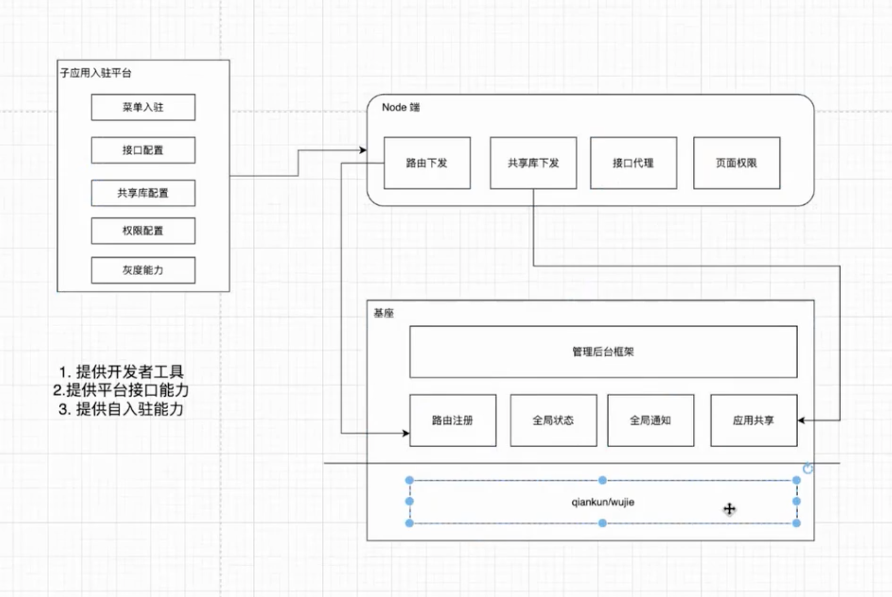

工程化，项目实践

[TOC]

# 指导思想

主要把项目说好，不要留给太多时间问八股，靠算法

二面主要涉及：

工程
管理


# 主说项目


目前这块主要说：
1. 微前端： 大概原理，（需要时可以说：加载过程，本地拉基座），和同类横向比较
2. 性能优化： 项目的衡量标准，横向对比业界工具
3. 多环境： 实施方案，横向对比业界方案
4. 测试环境自动化部署


# h5

应用分类：
- 原生 app
  - ios, android 不兼容，需要开发两套代码，最高的成本，最好的体验
- web app
  - 只需要浏览器就可以运行，跨平台，成本低；应用更新，用户不需要重新下载；浏览器本身性能限制会影响用户体验，而且前端技术没办法实现所有原生功能；
- hybrid app
  - 跨平台，还可以使用原生的特性，提供给用户比较好的体验

WebView: 移动端网页运行在手机应用内嵌的浏览器引擎中，这个没有 UI 的内核容器统称 WebView

H5(js) 与原生应用的交互:
- 1. 通过url拦截（url scheme）: 只用于Web端调用Native端
    - 可以自定义协议（协议名约定好，比如jssdk,原生代码看到这协议就知道是js在传递信息，而不是要跳转），然后问号传参
    - h5端用可以用location的方式，或者iframe src的方式，发送url, app端把这个url拦截，根据url内容进行操作
      - location的方式连续调用原生会丢失一部分调用
    - 缺点:url有长度限制，而且创建请求需要一定耗时
      - 之前为了兼容ios6,很多用的是这个方式
- 2. 注入api: H5 与原生应用的交互都是通过原生应用中的 WebView 实现的,原生向webView中注入api对象，同时原生也可以通过webview执行js暴露的api （这种方式用的比较多）
  - 通过这个环境
    - Native调用Web端是通过webview直接在JS的Context直接执行JS代码
    - Web端调用Native， native通过webview 向JS的Context（window）注入Api， web端可以直接用
  -   现在已经有开源的DSBridge（主要通过注入API的形式）， JSBridge（主要通过拦截URL Schema）
  - 3. 通过弹窗拦截，alert，confirm，prompt等（自己调试的时候可以用）
    - 原生代码会拦截捕获js弹窗，原生代码可以获得弹窗代码弹出的消息，并且原生应用可以向js环境注入代码


同时兼容单独使用与嵌入app的方式：
- 路由抹平
- 视样式抹平，窗上下边距抹平，一些样式的兼容(遇到再补充吧死记硬背，也没啥意思)
- 交互抹平， 比如有的地方要调用桥，需要处理一下


# 1. 微前端

面试中问微前端的话，可以说：

- 原理（隔离原理）
- 加载过程
- 和同类横向比较；
- qiankun 的具体落地问题处理
- 业务落地的架构设计实践

## 好处

- 跨团队或跨部门协作开发项目导致效率低下的问题: 解决不同团队，不同技术栈的协同开发问题，不同的子应用可以交给不同的团队（不同技术栈）来管理

- 随着项目迭代应用越来越庞大，难以维护: 大应用拆分问题，随着应用越来越大，项目体积越来越大，打包部署越来越慢， 技术升级或者重构相当麻烦, 维护也越来越困难,将应用拆分，每个应用独立运行，独立部署，还可以随意组合，这样就更加灵活;


qiankun 2.0 带来的最大变化便是 qiankun 的定位将由 微前端框架 转变为 微应用加载器。


比较适合性能不敏感场景，管理后台场景；

## single-spa

特点：

实现了路由劫持和应用加载

缺陷：
  - 1. 本身没有隔离机制，切换子应用，用的是同一个window；
    - 没有处理样式隔离，没有js沙箱机制
  - 2. 不够灵活，不能动态加载子应用js文件，需要手动引入。

原理：

- 1. 在主应用里注册子应用，当url路径匹配上子应用，会请求子应用的包，加载子应用到script标签里
- 2. 子应用运行，在window 上挂上协议对象，bootstrap, mount ,unmount,调用子应用的mount方法，把子应用的dom挂在父应用指定元素下
- 3. 在子应用判断，如果被父应用引入，那么请求地址(加载文件)要基于子应用（也就是起始地址，域名端口号，配置__webpack_pulic_path__,  发请求的时候会把这个路径拼在前面）,
- 4. 子应用的路由切换， 要基于其在父应用里的基本路径（配置webpack, content base), 再判断如果不是挂载在父应用下（两种情况下挂载方式不同），就单独挂载一下就好了


qiankun 基于Single-spa, 提供了更加开箱即用的api(single-spa + sandbox + import-html-entry)做到了，技术栈无关，并且接入简单（像iframe一样简单）

对比qiankun, qiankun 基于single-spa， 主要的完善点：

- 1. 子应用资源由 js 列表修改进为一个url(利用qiankun 内部包import-html-entry 加载资源)，大大减轻注册子应用的复杂度 
- 2. 实现应用隔离，完成js隔离方案和css隔离方案 
- 3. 增加资源预加载能力，预先子应用html、js、css资源缓存下来，加快子应用的打开速度


总结： qiankun 在single-spa的基础上，解决了它缺陷，也就是增加了隔离和更简单的接入


## 为什么不用iframe; 横向比较？

- 1. 路由状态丢失，刷新一下，iframe的url状态就丢失了
- 2. dom割裂严重，弹窗只能在iframe内部展示，无法覆盖全局
- 3. web应用之间通信非常困难
- 4. 每次打开白屏时间太长，对于SPA 应用来说无法接受


## 微前端核心原理

微前端框架要解决应用隔离的问题：
- 1.  要解决js隔离，css隔离，
- 2.  路由同步的问题.

### qiankun微前端原理与架构

乾坤相对于single-spa,做了两件重要的事情，其一是加载资源（注册方式修改），第二是进行资源隔离，第三预加载；

目前用的qiankun 2.x

#### Shadow Dom

css 隔离的方案之一

在影子dom里，可以让里面的元素不被外界访问到，不受外界控制

qiankun会将微应用插入到 qiankun 创建好的 Shadow Tree 中，微应用的样式（包括动态插入的样式）都会被挂载到这个 Shadow Host 节点下，因此微应用的样式只会作用在 Shadow Tree 内部，这样就做到了样式隔离。

Shadow Dom的问题：
- 一些组件可能会越过 Shadow Boundary 到外部 Document Tree 插入节点，而这部分节点的样式就会丢失；比如 antd 的 Modal 就会渲染节点至 ducument.body ，引发样式丢失；
  - 针对刚才的 antd 场景你可以通过他们提供的 ConfigProvider.getPopupContainer API 来指定在 Shadow Tree 内部的节点为挂载节点，但另外一些其他的组件库，或者你的一些代码也会遇到同样的问题，需要你额外留心。


# qiankun 面试

## 沙箱隔离原理总论

### 1.加载

qiankun 加载子应用流程：

- 1. 先注册register应用，然后start( *这里可以配置预加载参数prefetch，开启预加载策略*，当前匹配的应用加载完毕后，在浏览器空闲的时候再去加载其他子应用，用的是requestIdleCallback, 也就是每一帧的空闲时间)。

- 2. 当路径匹配后开始加载。首先拉取入口html文件，解析拿到tmplate模版（*html里会把所有的script脚本， link样式都注释掉*），script脚本和style样式表 ， 以及加载script脚本后可执行的script的内容（请求回script脚本才能执行， 不过也有部分script可能不需要请求）

- 3. 对子应用模版进行一些处理：*head标签要换一个名，比如qiankun-head， 创建一个div， 把请求回来的模版（html）放到div里（指定的 container 中）*
  - div 里 可以包html， 只不过在展示是，html 会自动把内存html和head标签去掉, 所以可以改下head标签名，把head标签留下来


- 4. 然后把js放到沙箱里执行
  - 主要的技术手段包括 with 语句和 new Function 构造函数
    - with 语句可以将一个`对象添加到作用域链的顶部`，从而可以在不修改原始代码的情况下，将代码执行上下文切换到指定的对象。使用 with 语句将 window 对象替换为代理对象，然后使用 new Function 在这个新的执行上下文中运行子应用的代码。
    - ```
    const windowProxy = new Proxy(window, traps);

    with(windowProxy) {
      // 应用代码，通过 with 确保所有的全局变量的操作实际都是在操作 qiankun 提供的代理对象
      ${appCode}  
    }

    ```


### 2. 隔离

单实例：同一时间只会渲染一个微应用
多实例： 同一时间可以渲染多个微应用


qiankun有相对完备的沙箱方案：
- js沙箱机制主要包括两种：快照沙箱和Proxy 沙箱。
  - 1. SnapshotSandbox 快照沙箱（在旧版浏览器中使用）：（单实例） 原理是切换时， 做所有属性的 Diff，把区别保存起来（存储js变更的快照）
    - 进入沙箱： 记录原来window的快照，将上一次沙箱环境覆盖到window
    - 离开沙箱： 将上一次window快照覆盖到window, 同时对比沙箱环境和window快照， 将对比结果保存下来
  - 2. Proxy 沙箱 (Proxy Sandbox)（单实例和多实例）： 使用现代浏览器支持的 Proxy 对象实现，适用于大多数现代浏览器。
    - 原理：proxy 代理
      - 1. 在激活子应用时，通过保存原始的 window 对象，并将 window 替换为 代理window(fakeWindow)，确保子应用所有对全局变量的访问都通过 fakeWindow 进行。停用时再恢复原始的 window，确保主应用和其他子应用不会受到影响。
      - 2. fakeWindow 只是一个空对象，所有对子应用全局变量的修改和设置都发生在这个对象上。当访问一个属性时，如果 fakeWindow 上没有这个属性，则代理会自动访问原始的 window 对象
      - 另一种解释：
      - 把*浏览器的原生属性都复制到一个空对象fakeWindow上*，这样对于每个沙箱环境都会有一个相对干净的浏览器环境了，给每个子应用分配一个fakeWindow， 通过 Proxy 代理fakeWindow，拦截对全局对象的访问和修改
  


qiankun 的样式有三种隔离方式：

- 1. 默认沙箱： 动态样式表样式隔离
- 默认情况下,会开启沙箱，这时，qiankun可以*确保单实例场景子应用之间的样式隔离*，但是*无法确保主应用跟子应用、或者多实例场景的子应用样式隔离*。
  - *dynamic stylesheet 动态样式表，当应用切换时移除老应用样式，添加新应用样式*，这样子应用之间不会污染，但是在同一个文档流中，子应用样式会污染主应用
-  这时需要自己有一些处理：
  -  自己加样式前缀，有如下两种方式:
  -  1. 严格使用用css module ，子应用自己去解决
     -  全靠组员自觉了
  -  2. 给子应用的所有样式添加一个前缀， 配置修改webpack打包时硬性给每个样式加上前缀
- 2. 严格沙箱： shadow dom样式隔离 
- 当配置为 *{ strictStyleIsolation: true } 时表示开启严格的样式隔离模式*。这种模式下 qiankun 会为*每个微应用的容器包裹上一个 shadow dom 节点*，从而确保微应用的样式不会对全局造成影响。
  - 基于 ShadowDOM 的严格样式隔离并不是一个可以无脑使用的方案，大部分情况下都需要接入应用做一些适配后才能正常在 ShadowDOM 中运行起来， 问题较多，在qiankun3 可能这个ShadowDOM隔离方案就会被废弃了，需要适配的如下：todo https://github.com/facebook/react/issues/10422
    - 子应用的弹窗、抽屉、popover*因找不到主应用的body会丢失*，或跑到整个屏幕外
    - 主应用不方便去修改子应用的样式
    - iconfont字体是不能放在shadowdom 里加载的
    - svg问题
    - react 点击事件问题
- 3. 实验沙箱：添加前缀样式隔离
  - 使用qiankun的实验特性，qiankun 还提供了一个实验性的样式隔离特性，当 experimentalStyleIsolation 被设置为 true 时，qiankun 会改写子应用所添加的样式为所有样式规则增加一个特殊的选择器规则来限定其影响范围
  - 缺点： 子应用的弹窗、抽屉、popover因插入到了主应用的body，所以导致样式丢失或应用了主应用了样式


可能遇到的问题：

- 1. 加前缀可能会遇到，ui库污染的问题： （因为默认改前缀不会改组件库的前缀）
  - 主应用和子应用使用的ui库（比如antd）版本不同， 造成的样式污染
    - 解决方案2种：
    - 1. ui库在主应用统一cdn引入，统一版本
      - 在微前端架构中，将 UI 库在主应用中通过 CDN 引入，并在子应用中不重复引入，是一种常见的优化方式。这种方式可以减少子应用的打包体积和加载时间，同时避免样式冲突问题
      - 当你在主应用中通过 CDN 引入了 UI 库（如 Ant Design），这些库的全局变量会被注册在浏览器的全局对象（window）上。子应用运行时，可以访问这些全局变量。
      - 通过 CDN 引入的 CSS 文件会被插入到主应用的 <head> 标签中。这些样式会应用于整个页面，包括子应用的 DOM 元素，除非子应用使用了 Shadow DOM 来进行样式隔离
    - 2. 修改主应用ui库的前缀，针对ui库配置打包工具，修改其前缀，有的ui提供了相关的修改方法， 例如*如果ui库是antd,可以用@ant-prefix*， 配置如下：
      - 这里有点混乱，我已经忘了当时橙管家里是加前缀，是为了解决ui库的样式冲突，还是全局样式冲突，按道理说如果把ui库用cdn引入，应该就不会有父子应用样式冲突的问题

    ```
    1. 配置webpack修改 less 变量:

    {
      loader: 'less-loader',
      options: {
        modifyVars: {
          '@ant-prefix': 'yourPrefix',
        },
        javascriptEnabled: true,
      },
    }

    modifyVars 允许运行时修改less变量，Less文件将在不重新加载的情况下重新编译


    2. antd ConfigProvider：

    import { ConfigProvider } from 'antd';

    export const MyApp = () => (
      <ConfigProvider prefixCls="yourPrefix">
        <App />
      </ConfigProvider>
    );


    ConfigProvider全局化配置, 提供了设置统一样式前缀的属性：prefixCls 

    ```

- 2. 针对子应用（antd）弹窗、下拉、抽屉、popover 因为Shadow Dom或者 加了样式前缀隔离 导致的样式丢失，错乱的问题
  - 因为此时，这些弹窗一般是要插入到body里的，是需要应用全局样式的；而隔离造成了他们不能正确的获取全局样式；
  - 解决方案：
    - 1. 可以限定这些弹窗的挂载点在，容器内，而不是全局body

    利用antd全局配置ConfigProvider 的getPopupContainer 属性，指定这些弹窗，下拉的挂载点；

    ```
    <ConfigProvider locale={zh_CN} getPopupContainer={() => document.getElementById('app')} >
          <App />
    </ConfigProvider>

    ```
   - 2. 把相应样式放到基座中，这样及时弹窗挂载到body中，也会有对应样式；


js隔离， 快照沙箱和proxy沙箱， 这种方式并不能完全的隔离，还有可能突破沙箱, 如果想完全隔离，有两种方式 
- 1. 还在草案阶段： shadowrealms
- 2. 把iframe 捡起来： 把js放在iframe里跑，页面（html+css）正常放在主页面里，js里调用的一些api的时候(document的接口), 做一个代理（从iframe代理到主页面），让它可以调到页面里，这样在iframe里的js,永远无法突破iframe,就很好的隔离了 (这个是现在的主流方式，新做的微前端框架式这种方式，比如无界)

### 应用通信

应用之间应该怎么通信呢？有很多方式：

- 1. 基于Url来进行数据传递
  - 通信简单
  - 传递信息能力弱（携带信息少）
    - 例如主应用需要识别渲染哪个子应用可以在URL地址栏加上子应用id

- 2. 发布订阅模式， 基于（浏览器提供的自定义事件）CustomEvent 实现通信
  - 功能完善，但通信相对复杂
  - 子应用需要熟悉主应用有哪些信息可以改，以及其含义

- 3. 基于props主子应用间通信
  - 通信简单
  - 一般只适合从主应用到子应用的信息传递

- 4. 使用全局变量， redux进行通信
  - 和方式2类似

#### qiankun 应用通信

- 1. 基于props主子应用间通信： 
  - 在一些简单场景下，基于 props 的方案会更直接便捷
- 2. GloabalState （事件机制）
  - 1. 主应用创建共享状态initGloabalState： initGloabalState({ user: 'kuitos' });
    - initGloabalState定义全局状态，并返回通信方法， 一般在主应用使用
      - 通信方法： onGlobalStateChange（订阅监听）， setGlobalState（派发修改）， offGlobalStateChange（移除监听）
    - 微应用通过 props 获取通信方法。
  - 2. 微应用通过 props 获取共享状态并监听： 
  ```
    // 从生命周期 mount 中获取通信方法
    export function mount(props) {
      props.onGlobalStateChange((state, prevState) => {
        // state: 变更后的状态; prev 变更前的状态
        console.log(state, prevState);
      });

      props.setGlobalState(state);
    };
  ```
  - 3. 通过全局存储通信
    - localStorage/sessionStorage， 适合一些全局共享的信息

### 公共依赖

对于公共依赖的处理方式：

CDN 引入- 搭配webpack 的 externals

webpack5 的联邦模块


#### 微前端业务落地（架构）

基座端：

上层是管理后台框架， 底层是qiankun或者无界微前端框架， 中间有一层代理，代理qiankun 的api， 不把qiankun的接口直接暴露给子应用使用，为以后扩展或者跟换微前端框架做准备，
到时候就不用到处去找qiankun相关的调用了，直接在中间这一层做修改就好了；
中间这一层提供路由注册， 全局状态， 全局通知，应用共享（公共包共享，比如子应用不需要再把react包打包进来，又基座提供）的能力；


node端 （bff层）
子应用的路由状态一般是通过服务端下发的，通过服务端下发就不需要每次都要改基座的代码，让它再去加一个路由
这一层有 路由下发（路由下发一般是会做的）， 共享库的下发，接口代理， 页面权限的能力


子应用入驻平台：如果有node端的能力，对标过来，团队就可以自己做应用入驻（就不用每个人都去修改基座了）
有菜单入驻， 接口配置， 共享库配置，权限配置， 灰度能力
这一套架构可以结合低代码去用，低代码搭建的页面，从子应用入驻平台入驻进来


开发工具： 启动开发的时候，是基于基座去启动开发的，因为单独运行页面的时候跟真实在基座里面跑是有区别的；可以提升开发体验
 启用一些webpack 插件，帮助基座加载页面就行了；

开发者工具是怎么做的；平台提供了哪些能力,怎么实现的；怎么自入驻；


团队大了，人与人之间的协作，最好还是基于工具了运行；如果一个东西频繁的改，那么就把它配置化；如果一个东西要频繁的加，我们就把它服务化；


这个微前端架构图值得好好研究一下：




### qiankun 实战

1.  主应用： 起个基座容器，安装qiankun,注册应用, 启动

```
1.

npm i qiankun

2. 

const apps = [
  {
    name: 'child1',
    entry: '//localhost:10000', // 当应用加载的时候，不需要去写加载函数了，它活默认加载还这个entry 指向的html, 解析里面的js, 动态的执行（因为请求了子应用的资源，子应用必须支持跨域）
    container: '#child1',
    activeRule: '/child1',  // 当请求 activeRule 就把 entry  挂在到 container 上；
  },
  {
    name: 'child2',
    entry: '//localhost:20000', // 当应用加载的时候，不需要去写加载函数了，它活默认加载还这个entry 指向的html, 解析里面的js, 动态的执行（因为请求了子应用的资源，子应用必须支持跨域）
    container: '#child2',
    activeRule: '/child2',  // 当请求 activeRule 就把 entry  挂在到 container 上；
  },
];

registerMicroApps(apps);

ps： 注意这些子应用容器不要写在路由里？

3. 

start();


```

1.  子应用： 子应用不需要装qiankun 相关包， 协议接入， 技术栈无关

```

1. 重写配置文件

（1）如果是react, 装包react-app-rewired， 可以重写默认的react 项目配置

npm i react-app-rewired 

(2) 然后把，package.json 里的scripts 脚本中的启动命令react-scripts 都替换成react-app-rewired

(3) 在项目package.json 同级写配置文件： config-overrides


module.exports = {
  webpack: (config)=>{
    config.output.library = 'reactApp'; 
    config.output.libraryTarget = 'umd';
    config.output.publicPath = 'http://localhost:20000/'
    return config;
  },
  devServer: (configFunction)=>{
    return function(proxy, allowedHost){
      const config = configFunction(proxy, allowedHost);
      config.headers = {
        "Access-Control-Allow-Origin": '*',
      }
      return config;
    }
  }
}

(4). 配下env 环境变量，在同级目录建.env  （这种也可以在别的地方写，不一定非要.env）

PORT = 20000;
// WDS_SOCKET_PORT = 20000; // 默认的socket 服务是往3000发的，所以要配一下，防止热更新出错 (加上后报错了，这一项可以不要)


到这里已经可以了，已经可以运行微应用机制了；

额外步骤配路由：


```


### 微前端的一些问题

- 1. 在使用 qiankun 时，你如何处理 js 沙箱不能解决的 js 污染问题？

>  qiankun 的 js 沙箱机制主要是通过代理 window 对象来实现的，它可以有效地隔离子应用的全局变量，防止子应用之间的全局变量污染。然而，这种机制并不能解决所有的 js 污染问题。例如，如果我们使用 onclick 或 addEventListener 给 <body> 添加了一个点击事件，js 沙箱并不能消除它的影响。

对于这种情况，我们需要依赖于良好的代码规范和开发者的自觉。在开发子应用时，我们需要避免直接操作全局对象，如 window 和 document。如果必须要操作，我们应该在子应用卸载时，清理掉这些全局事件和全局变量，以防止对其他子应用或主应用造成影响。

如果我们在子应用中添加了一个全局的点击事件，我们可以在子应用的 unmount 生命周期函数中移除这个事件


- 2. 你能解释一下 qiankun 如何实现 keep-alive 的需求吗?

> 在 qiankun 中，实现 keep-alive 的需求有一定的挑战性。这是因为 qiankun 的设计理念是在子应用卸载时，将环境还原到子应用加载前的状态，以防止子应用对全局环境造成污染。这种设计理念与 keep-alive 的需求是相悖的，因为 keep-alive 需要保留子应用的状态，而不是在子应用卸载时将其状态清除。

可以手动*loadMicroApp+display:none，直接隐藏Dom*, 当然这样应用多了会卡顿，可以限制一下


- 3. 你能解释一下 qiankun 和 iframe 在微前端实现方式上的区别和优劣吗？在什么情况下，你会选择使用 iframe 而不是 qiankun？

qiankun 是基于 single-spa 的微前端解决方案，它通过 JavaScript 的 import 功能动态加载子应用，然后在主应用的 DOM 中挂载子应用的 DOM。qiankun 提供了一种 JavaScript 沙箱机制，可以隔离子应用的全局变量，防止子应用之间的全局变量污染。此外，qiankun 还提供了一种样式隔离机制，可以防止子应用的 CSS 影响其他应用。这些特性使得 qiankun 在处理复杂的微前端场景时具有很高的灵活性。

iframe 是一种较为传统的前端技术，它可以在一个独立的窗口中加载一个 HTML 页面。iframe 本身就是一种天然的沙箱，它可以完全隔离子应用的 JavaScript 和 CSS，防止子应用之间的相互影响。然而，iframe 的这种隔离性也是它的缺点，因为它使得主应用和子应用之间的通信变得困难。此外，iframe 还有一些其他的问题，比如性能问题、SEO 问题等。


- 4. 在使用 qiankun 时，你如何处理多个子项目的调试问题？

在使用qiankun处理多个子项目的调试问题时，通常的方式是将每个子项目作为一个独立的应用进行开发和调试。每个子项目都可以在本地启动，并通过修改主应用的配置，让主应用去加载本地正在运行的子应用，这样就可以对子应用进行调试了。这种方式的好处是，子应用与主应用解耦，可以独立进行开发和调试，不会相互影响。


- 5. qiankun是如何实现CSS隔离的，该方案有什么缺点，还有其它方案么？

qiankun主要通过使用Shadow DOM来实现CSS隔离。Shadow DOM是一种浏览器内置的Web标准技术，它可以创建一个封闭的DOM结构，这个DOM结构对外部是隔离的，包括其CSS样式。qiankun在挂载子应用时，会将子应用的HTML元素挂载到Shadow DOM上，从而实现CSS的隔离。

对于qiankun的隔离方案，一个潜在的缺点是它需要浏览器支持Shadow DOM，这在一些旧的浏览器或者不兼容Shadow DOM的浏览器中可能会出现问题。
另一种可能的方案是使用CSS模块（CSS Modules）。CSS模块是一种将CSS类名局部化的方式，可以避免全局样式冲突。在使用CSS模块时，每个模块的类名都会被转换成一个唯一的名字，从而实现样式的隔离。

- 6. qiankun中如何实现父子项目间的通信？如果让你实现一套通信机制，你该如何实现？

Actions 通信：qiankun 官方提供的通信方式，适合业务划分清晰，较简单的微前端应用。这种通信方式主要通过 setGlobalState 设置 globalState，并通过 onGlobalStateChange 和 offGlobalStateChange 来注册和取消 观察者 函数，从而实现通信。

自己实现一套通信机制：可以

  - 1. 利用全局变量：在全局（window）对象上定义共享的属性或方法。这种方式简单明了，但有可能导致全局污染，需要注意变量命名以避免冲突。
  - 2. 自定义事件机制：可以自己写一套类似redux的发布订阅事件机制， dispatch或者emit来，派发事件，改数据， subscribe或者on来订阅事件（监听事件）

- 7. 在主项目中使用qiankun注册子项目时，如何解决子项目路由的hash与history模式之争？
  - 1. 如果主项目使用 history 模式，并且子项目可以使用 history 或 hash 模式，这是 qiankun 推荐的一种形式。在这种情况下，子项目可以选择适合自己的路由模式，而且对于已有的子项目不需要做太多修改。但是子项目之间的跳转需要通过父项目的 router 对象或原生的 history 对象进行。
  - 2. 如果主项目和所有子项目都采用 hash 模式，可以有两种做法：
    - 1. 使用 path 来区分子项目：这种方式不需要对子项目进行修改，但所有项目之间的跳转需要借助原生的 history 对象。
    - 2. 使用 hash 来区分子项目：这种方式可以通过自定义 activeRule 来实现，但需要对子项目进行一定的修改，将子项目的路由加上前缀。这样的话，项目之间的跳转可以直接使用各自的 router 对象或 <router-link>。（不太懂）

- 8. 在qiankun中，应用之间如何复用依赖，除了npm包方案外？

  - 1. 在使用webpack构建的子项目中，要实现复用公共依赖，需要配置webpack的externals，将公共依赖指定为外部依赖，不打包进子项目的代码中。
  - 2. 子项目复用主项目的依赖：可以通过*给子项目的index.html中的公共依赖的script和link标签添加自定义属性ignore来实现*。在qiankun运行子项目时，qiankun会忽略这些带有ignore属性的依赖，子项目独立运行时仍然可以加载这些依赖。
  - 3. 在使用qiankun微前端框架时，可能会出现子项目之间和主项目之间的全局变量冲突的问题。这是因为子项目不配置externals时，子项目的全局Vue变量不属于window对象，而qiankun在运行子项目时会先找子项目的window，再找父项目的window，导致全局变量冲突。
  - 4. 解决全局变量冲突的方案有三种：
    - 方案一是在注册子项目时，在beforeLoad钩子函数中处理全局变量，将子项目的全局Vue变量进行替换，以解决子项目独立运行时的全局变量冲突问题。
    - 方案二是通过主项目将依赖通过props传递给子项目，子项目在独立运行时使用传递过来的依赖，避免与主项目的全局变量冲突。
    - 方案三是修改主项目和子项目的依赖名称，使它们不会相互冲突，从而避免全局变量冲突的问题。

- 9. 说说webpack5联邦模块在微前端的应用

> Webpack 5 的联邦模块（Federation Module）是一个功能强大的特性，可以在微前端应用中实现模块共享和动态加载，从而提供更好的代码复用和可扩展性(需要配置ModuleFederationPlugin)
  - 9.1 模块共享
    - Webpack 5 的联邦模块允许不同的微前端应用之间共享模块，避免重复加载和代码冗余。通过联邦模块，我们可以将一些公共的模块抽离成一个独立的模块，并在各个微前端应用中进行引用。这样可以节省资源，并提高应用的加载速度。
  ```
  // main-app webpack.config.js
  const HtmlWebpackPlugin = require('html-webpack-plugin');
  const { ModuleFederationPlugin } = require('webpack').container;

  module.exports = {
    // ...其他配置

    plugins: [
      new HtmlWebpackPlugin(),
      new ModuleFederationPlugin({
        name: 'main_app',
        remotes: {
          shared_module: 'shared_module@http://localhost:8081/remoteEntry.js',
        },
      }),
    ],
  };

  // shared-module webpack.config.js
  const { ModuleFederationPlugin } = require('webpack').container;

  module.exports = {
    // ...其他配置

    plugins: [
      new ModuleFederationPlugin({
        name: 'shared_module',
        filename: 'remoteEntry.js',
        exposes: {
          './Button': './src/components/Button',
        },
      }),
    ],
  };

  在上述示例中，main-app 和 shared-module 分别是两个微前端应用的 webpack 配置文件。通过 ModuleFederationPlugin 插件，shared-module 将 Button 组件暴露给其他应用使用，而 main-app 则通过 remotes 配置引入了 shared-module。


  ```

  - 9.2 动态加载
    - Webpack 5 联邦模块还支持动态加载模块，这对于微前端应用的按需加载和性能优化非常有用。通过动态加载，可以在需要时动态地加载远程模块，而不是在应用初始化时一次性加载所有模块。

  ```
  // main-app
  const remoteModule = () => import('shared_module/Button');

  // ...其他代码

  // 在需要的时候动态加载模块
  remoteModule().then((module) => {
    // 使用加载的模块
    const Button = module.default;
    // ...
  });

  在上述示例中，main-app 使用 import() 函数动态加载 shared_module 中的 Button 组件。通过动态加载，可以在需要时异步地加载远程模块，并在加载完成后使用模块。

  ```
- 10. 说说qiankun的资源加载机制（import-html-entry）
  - qiankun import-html-entry 是qiankun 框架中用于加载子应用的 HTML 入口文件的工具函数。它提供了一种方便的方式来动态加载和解析子应用的 HTML 入口文件，并返回一个可以加载子应用的 JavaScript 模块。
  - import-html-entry 实现了以下功能：
  - 10.1 加载 HTML 入口文件：import-html-entry 会通过创建一个 <link> 标签来加载子应用的 HTML 入口文件。这样可以确保子应用的资源得到正确加载，并在加载完成后进行处理。
  - 10.2 解析 HTML 入口文件：一旦 HTML 入口文件加载完成，import-html-entry 将解析该文件的内容，提取出子应用的 JavaScript 和 CSS 资源的 URL。
  - 10.3 动态加载 JavaScript 和 CSS 资源：import-html-entry 使用动态创建 <script> 和 <link> 标签的方式，按照正确的顺序加载子应用的 JavaScript 和 CSS 资源。
  - 10.4 创建沙箱环境：在加载子应用的 JavaScript 资源时，import-html-entry 会创建一个沙箱环境（sandbox），用于隔离子应用的全局变量和运行环境，防止子应用之间的冲突和污染。
  - 10.5 返回子应用的入口模块：最后，import-html-entry 返回一个可以加载子应用的 JavaScript 模块。这个模块通常是一个包含子应用初始化代码的函数，可以在主应用中调用以加载和启动子应用。


### 说说现有的几种微前端框架，它们的优缺点？

前置知识：

  webcomponent 的 shadow DOM： shadowRoot是shadow DOM， 相当于一个阉割的 document，但它只有独立的 css 作用域而没有独立的 js 作用域，内部元素的样式在未单独做修饰的情况向，就是浏览器默认样式，完全不受外部样式的影响。shadowRoot 与 document 访问到的是同一个 window 对象。


 - 0. iframe

  优点：
  - 非常简单，使用没有任何心智负担
  - web应用隔离的非常完美，无论是js、css、dom都完全隔离开来

  缺点：由于其隔离的太完美导致缺点也非常明显
  - 路由状态丢失，刷新一下，iframe的url状态就丢失了
  - dom割裂严重，弹窗只能在iframe内部展示，无法覆盖全局
  - web应用之间通信非常困难
  - 每次打开白屏时间太长，对于SPA 应用来说无法接受


- 1. qiankun

  总结： 
  - 优点：生态比较成熟， 经过大量项目实践，可参考案例多
  - 缺点： 有js/css沙箱，但是不完美，文档相对不那么友好，报错提示写的不是很清楚
  
  优点： 
  - 1.1 通过html entry的方式引入子应用（注册html入口）， 相比js entry极大的降低了应用改造的成本
  - 1.2 提供了完备的沙箱方案，包括js沙箱和css沙箱；
    - 完备的沙箱方案，js沙箱做了SnapshotSandbox、LegacySandbox、ProxySandbox三套渐进增强方案，css沙箱做了两套strictStyleIsolation、experimentalStyleIsolation两套适用不同场景的方案
  - 1.3 支持静态资源预加载能力。
  - 1.4 路由保持，浏览器刷新、前进、后退，都可以作用到子应用

  缺点：
  - 改造成本较大，从 webpack（让主应用能正确识别微应用暴露出来的一些信息，微应用的webpack的output里需要增加一些配置）、代码(注册，生命周期等)、路由等等都要做一系列的适配；
    - 微应用之间的跳转，或者微应用跳主应用页面，直接使用微应用的路由实例是不行的，如 raact-router 的 Link 组件或 vue 的 router-link，原因是微应用的路由实例跳转都基于路由的 base， 这时需要用原生的，history.pushState()， 修改 location href 跳转，如：window.location.href = 'http://localhost:8080/app1'
  - 基于路由匹配，无法同时激活多个子应用，也不支持子应用保活
  - css 沙箱无法绝对的隔离，js 沙箱在某些场景下执行性能下降严重；
  - 不支持vite等esmodule脚本运行（这一点可能会比较麻烦）

  qiankun是基于single-spa的， single-spa主要实现思路：

  - 预先注册子应用(激活路由、子应用资源、生命周期函数)
  - 监听路由的变化，匹配到了激活的路由则加载子应用资源，顺序调用生命周期函数（bootstrap、mount、unmount）并最终渲染到容器

  乾坤微前端架构则进一步对single-spa方案进行完善，主要的完善点：

  - 子应用资源由 js 列表修改进为一个url，大大减轻注册子应用的复杂度
  - 实现应用隔离，完成js隔离方案 （window工厂） 和css隔离方案 （类vue的scoped）
  - 增加资源预加载能力，预先子应用html、js、css资源缓存下来，加快子应用的打开速度


- 2. 无界方案
  优点：
  - 基于 webcomponent 容器（css隔离）和 iframe 沙箱（js隔离），充分解决了适配成本、*样式隔离*、运行性能、页面白屏(预加载，requestIdleCallback)、子应用通信、、多应用激活、*子应用保活*、*vite框架支持*、应用共享等问题。

  缺点：在继承了iframe优点的同时，缺点依旧还是存在
  - 隔离js使用了一个空的iframe,进行隔离
  - 
  
  底层原理： 
  - 1. js沙箱（隔离）： *将子应用的js注入主应用同域的iframe中运行，iframe是一个原生的window沙箱，内部有完整的history和location接口，子应用实例instance运行在iframe中，路由也彻底和主应用解耦，可以直接在业务组件里面启动应用。*
    - 好处： 
      - 组件方式来使用微前端，不用注册，不用改造路由，直接使用无界组件，化繁为简
      - 一个页面可以同时激活多个子应用， 子应用采用 iframe 的路由，不用关心路由占用的问题
      - 天然 js 沙箱，不会污染主应用环境， 不用修改主应用window任何属性，只在iframe内部进行修改
  - 2. iframe 连接机制和 css 沙箱机制： 
    - 无界采用webcomponent来实现页面的样式隔离，无界会创建一个wujie自定义元素，然后将子应用的完整结构渲染在内部；（天然 css 沙箱， 天然适配弹窗问题）
    - 子应用的实例instance在iframe内运行，dom在主应用容器下的webcomponent内，通过代理 iframe的document到webcomponent，可以实现两者的互联。
    - *当子应用发生切换，iframe保留下来，子应用的容器可能销毁，但webcomponent依然可以选择保留，这样等应用切换回来将webcomponent再挂载回容器上，子应用可以获得类似vue的keep-alive的能力.（子应用保活）*
  - 3. 路由同步机制： 劫持iframe的history.pushState和history.replaceState，就可以将子应用的url同步到主应用的query参数上，当刷新浏览器初始化iframe时，读回子应用的url并使用iframe的history.replaceState进行同步
  - 4. 通信机制： 承载子应用的iframe和主应用是同域的，所以主、子应用天然就可以很好的进行通信，在无界我们提供三种通信方式
    - props 注入机制， 子应用通过$wujie.props可以轻松拿到主应用注入的数据
    - window.parent 通信机制，子应用iframe沙箱和主应用同源，子应用可以直接通过window.parent和主应用通信
    - 去中心化的通信机制： 无界提供了EventBus实例，注入到主应用和子应用，所有的应用可以去中心化的进行通信

  
  使用shadow Dom 隔离css, 使用空的ifrage隔离js， 通讯使用的是proxy

  传参： 
  - 1. 子应用读主应用全局变量： window.parent.xx
  - 2. 主应用通过props给子应用传参，


- 3. micro-app 方案（京东）

  总结： 
  - 优点： 使用简单，子应用改动少
  - 缺点： 没有经过大量项目实践


  优点：
  - 使用 webcomponent 加载子应用,相比qiankun 注册监听的方式更优雅，简单一些；
  - 复用经过大量项目验证过的 qiankun 沙箱机制，提高了框架的可靠性；
  - 支持子应用保活；
  - 降低了子应用改造的成本，提供了静态资源预加载能力。

  缺点：
  - css 沙箱无法完全隔离，js 沙箱做全局变量查找缓存，性能有所优化；
  - 支持 vite 运行，但必须使用自定义插件 plugin （插件）改造子应用，适配成本高(用vite,不建议使用micro-app)
  - 对于不支持 webcomponent 的浏览器没有做降级处理。


micro-app并没有沿袭single-spa的思路，而是借鉴了WebComponent的思想，通过CustomElement结合自定义的ShadowDom，将微前端封装成一个类WebComponent组件，从而实现微前端的组件化渲染。并且由于自定义ShadowDom的隔离特性，micro-app不需要像single-spa和qiankun一样要求子应用修改渲染逻辑并暴露出方法，也不需要修改webpack配置，是目前市面上接入微前端成本最低的方案。

- 4. emp 模块联邦方案 （百度）

emp方案是基于webpack5的module federation(模块联邦)， 必须使用webpack5,强耦合；

一句话总结：与 webpack5强耦合， 没有沙箱， 可能跟适合组件共享

特点：

- webpack 联邦模块编译可以保证所有子应用依赖解耦
- 应用间去中心化调用、共享模块
- 模块远程ts支持

缺点：
- 对webpack强依赖，老旧项目不友好
- 没有有效的css沙箱，js沙箱， 需要靠用户自觉
- 没有子应用宝活， 多应用激活
- 主，子应用可能发生路由冲突


#### 微前端未来

原生js沙箱： shadowrealm正在路上


# 设计模式： 结合业务来说，待补充 todo

### 组件设计

类组件时代比较经典的就是，分为容器组件和展示组件，逻辑就放在容器组件里写，展示组件基本就纯展示；

hooks 时代主要是关注点分离(渲染层和业务逻辑层分离)

# 包管理

## 幽灵依赖

- 定义：在项目中引用了这包，但是这个包并没有在package.json 的 dependeceis 里声明

不在package.json里，但是在间接依赖里，正好你又在项目里引入了间接依赖；

## peerDependcies

它被用来指定一个包与其它包的“对等依赖”关系。

- 当前项目（包）需要某个包，但是不会在安装当前包时去主动去安装，需要用户自己手动安装
- 这样可以确保对等依赖的包在同一个项目中只会有一个实例存在，保证依赖包的一致性，避免可能出现的版本冲突问题
- npm 7 及更新的版本中，npm 规定了新的行为，即如果在安装时没有满足 peerDependencies 的对等依赖包，npm 会试图自动安装这些对等依赖包，而不仅仅是给出警告。这可能对一些老版本的应用造成不兼容的问题，因此需要谨慎对待。

## pnpm


- pnpm优势: 相比yarn, npm
  - 省空间：软链接, 把包存到一个地方 pnpm store 里，后续同样的包就不需要再安装，用软链接即可
    -  pnpm store里存放着： 包名+ 版本号+ peerDependcies 包名，版本号
  - 安装快： 如果安装过
  - pnpm 如何解决幽灵依赖的问题：pnpm 把包的依赖都拍平了， 放在了pnpm store里，找包的时候在node modules里找到软链接，再到pnpm store里找


## 包管理工具

- 如何确定包管理工具的版本号： 看.lock文件
- 如何确定项目所用的包管理工具的版本号： 看package.json 里的packageManager


## nginx


# webpack

## webpack 原理

### 1. webpack 打包产物结构
### 2. webpack 打包过程
### 3. webpack loader 和 plugin 原理


## webpack 优化

### 1. webpack 优化方向和思路

webpack 优化的方向和思路主要是，加快开发中的打包速度和减小打包体积；

面试主要说减小打包体积。

因为打包速度方面，有了微前端拆分应用和vite等降维打击做法，就不是很必要，简单了解即可；


1.生产环境调优主要是通过利用缓存、减少代码体积、分包等方式提升页面响应速度。对于spa单页的话通常需要通过优化减少首屏渲染时间。
2.开发环境调优的目的是提升webpack构建速度。如开启热更新和热模块（HMR）替换、缩小代码编译范围、多线程打包等


### 4. 优化常用的哪些插件

webpack-bundle-analyzer：  分析打包体积
purgecss-webpack-plugin： 可以去 除未使用的 css
terser-webpack-plugin： 对 js 文件进行压缩，从而减小 js 文件的体积，还可以压缩 html、css 代码


### 5. webpack减小打包体积

性能优化，一个很关键点就是减小体积，这方面，webpack能做不少工作，同时还有其他辅助手段，不过思路上类似，
从减少体积出发： 主要有 压缩，公共代码提取， 按需加载 （三个大的方面）

用webpack-bundle-analyzer 插件生成代码分析报告，报告里以直观的方式分析打包出的文件有哪些， 大小占比如何， 压缩后大小如何

- 1. *压缩*
  -  压缩图片，图片资源压缩， 降低图片分辨率，压缩图片体积等: image-wepback-loader
  -  压缩js，从而减小 js 文件的体积：webpack4 默认用 terser-webpack-plugin 压缩
  -  压缩css，optimize-css-assets-webpack-plugin
     -  无用css的擦除(去除未使用的 css)： purgecss-webpack-plugin, mini-css-extract-plugin
  -  gzip压缩， 配置js，css如何压缩,compression-webpack-plugin
  -  除了静态资源的压缩，打的接口也可以压缩，大于后端大的接口可以做gzip压缩
  

  
- 2. *公共代码提取*
  - 1. 将项目中的公共模块提取出来，可以减少代码的冗余度：通过SplitChunksPlugin（这是一个内置的插件）， 在 optimization.splitChunks 配置相关内容(可以自定义)
    - optimization.splitChunks 有一些默认的配置内容
    - webpack v4 开始，移除了 CommonsChunkPlugin，取而代之的是 optimization.splitChunks。
  - 2. 对于微前端项目，还可以将应用之间的公共包，在子应用用externals排除，在基座用cdn引入
    - 不过这样，就不能支持组件库按需加载能力，不会有treeshaking

```

optimization.splitChunks 里我们一般主要配置cacheGroups，抽取公共模块什么的，都在这个地方。

解释： 当x模块被多个chunk引用时，如果只发出一个HTTP请求，然后将x模块添加到缓存对象中，这样在其他chunk请求时，x模块将直接从缓存对象中查找； 如何决定哪些模块需要被缓存呢，这就需要使用到cacheGroup

priority：优先级，这在当一个模块存在于多个缓存组中具有重大的作用，它将决定模块属于哪个chunk。

minChunks：最小块，拆分前必须共享模块的最小 chunks 数， 也就是必须被多少个chunk, 引用才会新建一个chunk

minSize：最小大小，即当抽取的公共模块的大小，大于minSize所设置的值，才会为此创建一个新chunk

maxSize：如果引入的包大小已经超过了设置的最大值，那么webpack会尝试对该包再进行分割

test：匹配规则，说明要匹配的项


```

- 3. *按需加载*： 
  - 路由组件按需加载： 以使用按需加载，将每个路由页面单独打包为一个文件； 更精细化一点每个路由配置一个独特的webpackChunkname
  - 按需加载需引入第三方组件


webpack5 默认启动的：

生产环境：

- 1. *摇树*: treeshaking是一个术语，通常用于描述移除 JavaScript 上下文中的未引用代码（ dead-code ）
  - Webpack5 中，Tree Shaking 在生产环境下默认启动
  - 分析import/exports依赖关系，对于没有使用的代码自动删除


### 6. webpack 加快打包(构建)速度（个人感觉不重要，有降维做法）

- 1. 加速文件搜索
  - 缩小文件搜索范围（webpack搜索需要一层层搜索，缩短路径就能提高速度 ）
    - 合理使用resolve功能，resolve下有，alias（别名）, extensions（扩展名查找）, modules等
    - 配置loader 时， 使用test, exclude,include 缩小搜索范围
- 2. 通过DllPlugin和DllReferencePlugin 避免重复编译第三方库
  - DllPlugin： 创建一个dll-only-bundle,生成一个名为manifest.json的文件，用于让DllReferencePlugin能够映射到相应的依赖上
    - 把第三方库单独打包到一个文件， 这个文件就是一个单纯的依赖库
  - DllReferencePlugin： 把dll-only-bundles 引用到需要预编译的依赖中；
- 3. 使用HappyPack开启多进程loader 转换： happypack
  - loader 对文件的转换太耗时，js是单线程模型， 只能一个一个文件进行处理， 需要通过HappyPack 将任务分解为多个子进程，最终将结果发给主进程，并进行处理
- 4. 使用ParallelUglifyPlugin开启多进程压缩js文件: webpack-parallel-uglify-plugin
  - ParallelUglifyPlugin可以开启多个子进程，每个子进程UglifyJS压缩代码，可以并行执行， 能显著缩短压缩时间


# 工程简述： 对项目做一个总结和简说

### 多环境

*多环境这个项目说一个就被怼一个，似乎与自己有点犯冲，自己也确实对docker不是很熟。（作为第二选择吧）*就说这个是参与，除非我能把docker 整明白。

简述测试多环境：

- 部署: 部署路径，对于微前端可能是  微前端项目名/(子)项目名/分支名/代码（把之前这个目录下的内容清空，然后把新的资源【打包后的静态文件】拷贝进去；可能还得有个兜底资源，请求不到请求mater分支）
  - 怎么取到分支名的： 部署时，流水线注入的，本质上是用 Node.js 的 child_process 模块中的 exec 函数

- html里资源的引用及资源清单的生成: 配置测试环境下webpack的publicPath（index.html中引入的<script> <link>等标签中的资源路径前缀） 以及 WebpackManifestPlugin 里生成资源清单的资源前缀
  
- 访问： 最终我们是通过在location 中携带search 参数 ?branch=branch\_name , 以分支名来做前端资源版本隔离的， 实现前端多环境。 所以子应用中在做一些页面跳转的时候记得别把search 参数丢了 （有特殊跳转场景再做一下处理）
  
- 解析： 在nginx里获取到请求参数branch, 拼接成完整路径，用root定位到资源 (内建变量$arg_key 的值为当前请求中 key 所对应的查询值,  key大小写不敏感)
  
- 资源清理： 找出项目下超过15天未更新的（项目下就是各个分支资源了） 【命令有些常，不常用也不好记，用到再查就是了】

方案目的：
- 1. 无限测试环境，且新建环境方便不需要申请域名，及容器
  - *docker 似乎也可以做到这样，但是docker 需要运维同学参与进来,相比而言用docer做，方案更重一点*
    - 需要隔离环境，这个隔离环境用什么隔离，如果用目录


问： 业界还有什么方案？为什么不用docker
- 因为对docker 时不常特别熟悉


## 部署

部署一个前后端分离项目，需要做的事情  
- 1. 静态资源css,js， 图片等上cdn， cdn是静态缓存，用来放置那些不容易改变的静态文件
- 2. *html部署在渲染服务上*, 因为除了返回html, 这个服务可能还需要处理一些安全相关的东西
  - 大多数首页都还是服务器端渲染出来的(非静态)
  - 纯静态的页面放在cdn上，把缓存时间设为0也不是不行
- 3. 后端代码部署到api服务上


```


橙管家微前端复述：

从橙心优先自己做从采购到销售送货的步骤，的长链条重资产，变成了合伙人模式，帮当地大商把这个流程做好，出策划，买系统，让他们用我们的平台。

重新开发了橙管家系统，使用微前端架构，整体来说跟我们之间的内部系统oms有点像，不过这个橙管家整体功能更综合，细节功能及流程做了简化。

上面那个优化就是基于这个项目的。

我在这个项目中除了负责仓配模块的内容，还提供了本地开发配套。

本地拉基座，为了让本地能有基座的测试环境数据，避免本地开发起两个项目。

1. 在devServer的onbeforeSetupMiddleware 里做了拦截，发现路径是/，就重定向路径到/proxy-boss/(代理地址)。
> 如果要做本地的可以在这里区分，什么时候定向，啥时候不重定下

1. 请求菜单栏配置（这个是必须的）：如果请求/config.json(菜单栏配置)，就返回基座（写死）和本地应用的配置（本地开发时写死），其中基座的pathname(路径)写成/proxy-boss/datacenter/(这其实是基座里附带的一个子应用，不写似乎也可以),基座的manifest, 写成测试环境的基座资源清单（有了多环境后，就可以用master下的分支资源， .../master/entry-manifest.json）
> 后续点到对应的菜单拉取对应的资源

1. 代理转发:

```

1. 拉取基座html： 如果请求以/proxy-boss开头，就去掉/proxy-boss, 然后去代理到测试环境基座资源boss-sim.xxxx.com/datacenter/?branch=${分支名}/#/index； 
> 有了分支名，就会去请求对应分支名下的静态资源
> 没有分支名，不处理， 依然是本地访问地址localhost:9000

1. 拉取远程基座静态资源(js， css)： 如果是 /${分支名}/micro-base-static 开头，就代理到boss-sim.xxxx.com

> （本地这一套可能有点问题，可以先不说）2. 拉取本地基座静态资源(js, css)： 如果没有分支名，是/micro-base-static开头的，代理到local.boss.xxxx.com:9000 


ps: 启动的时候： 加环境变量 base（基座）为remote就拉测试环境远程基座，为local就拉本地基座；
在proxy中： 
proxyHost（代理域名）本地为 local.boss.xxxx.com:9000, 远程测试环境为boss-sim.xxxx.com；
resourceProxyPath: 远程为 boss-sim.xxxx.com/datacenter/?branch=${分支名}/#/index, 本地为local.boss.xxxx.com:9000。

```
> onbeforeSetupMiddleware (提供在服务器内部执行所有其他中间件之前执行自定义中间件的能力)先执行，proxy 后执行, proxy本质上也是中间件, proxy 在devServer 的before 和 after钩子之间执行
> 最关键的就是在onbeforeSetupMiddleware mock菜单栏配置，和proxy 代理转发请求测试环境远程静态资源；
> 这样基座html有了，点击到那个菜单再用默认行为去加载对应的资源就行了


资源管理平台复述：

这个主要是为了做灰度使用，它也有上线的能力；

> 所谓上线其实就是把前端资源放到线上服务器上，传到cnd上，用的是cdn上的资源。

前端做页面级可以用路由权限去控制，功能类就不好控制，需要根据具体的用户类型去判断写逻辑，上线时还要删除，不删除，后续维护又困难，所以需要做个灰度发布系统。

它的开发流程是这样的：

前端建立灰度分支，做开发。

开发测试完成后，选择在版本中心配置一些有灰度的仓， 选择灰度发布，会拉取对应分支代码，打包资源，生成一个资源版本的包，把这个包传到cdn上，会返回资源地址，生成一个版本号存到数据库；
> 这样我们就要了，仓，版本号，资源地址

```
这个过程详细一点表述：

1. 在版本中心配置灰度仓， 应用名， 分支名（应用名， 分支名是链接各方的关键字）。

2. 本地编译后，上传页面资源到cdn， cli-tool拿到资源地址；

3. 会通过自定义webpack插件cli-tool, 上传应用名， 分支名，和commit 版本号 ，资源地址， 版本中心生成版本号。


```


前端访问页面，请求后端接口，会判断仓类型（及应用名），如果在灰度仓内，会返回灰度资源地址，如果不在会返回正常线上资源地址。

如果回滚，就让找上一个稳点版本的资源；

灰度通过，点击上线，会自动合并灰度分支和master分支，如果有冲突，解冲突上线。

> 有个前提是同一时间只有一个灰度版本资源， 就是不能同时做多个灰度，多个会成本倍增，而且场景少，后续还要把多个灰度分支合并到master分支上线，可能会有冲突。


兜里方案，如果版本中心挂掉，则请求对应路径下default目录下的文件（每次上线会拷贝一份资源到同级的default目录下）


## 后台管理系统

- 权限： 
  - 菜单,按钮权限：显示时做判断，判断用户有没有这个权限
  - 防止用户直接输入url: 
    - vue的话可以用路由守卫
    - react的话，route 路由本身是个组件，可以在这个组件里写逻辑，有权限才显示对应路由
  


  ```

  // to代表需要访问的路由地址，from代表从哪个路由跳转而来，next()是放行函数，表示放行路由。
  router.beforeEach((to,from,next)=>{
    ...
    next()
  })

  ```

## 开发规范

代码格式和校验：
  - eslint
    - huskey: 在git hook里做一些操作
      - git hook
      - 如果不用huskey , 如何配置git hook?
    - lint-staged： 执行命令检查暂存区的文件


## 你是如何学习前端的

- 1. 看书（体系化）
- 2. 关注活跃的社区,大v的博客： github 的trending 榜单， 看一下js领域，星星比较多的项目


## 项目中的难点

- 1. 需要听到一些突破性的解决方案给出
  - 可以把项目的主要贡献集中在难点上，可以挖掘下，引导面试去问（如果一个项目可可问的少，也必定去问），然后准备好相关领域的难点，把相关领域知识，准备充分
- 2. 如果没有就只能从自己的理解出发嘞 
  - 1. 知识性的，查文档，同类项目，开源项目
  - 2. 
- 3. 如果自己从零到一，真的想做一个自己感兴趣的项目，其实会遇到很多难点


项目上除了性能和工程化，最好有一些专业领域的点。

用一些新出来的东西也算是亮点。


## 你有什么要问我的

- 1. 业务；
- 2. 团队构成； 了解团队结构；
- 3. 你们是裁员了么，还是扩招？


## 管理

管理团队  ： 向上管理与向下管理
  - 向上管理：
    - 1. 借用领导的影响力与争取资源
      - 借用领导的影响力
        - 1. 明确授权： 首先领导要明确授权，可以把相关的人拉进来，然后领导说一下，授权负责那些业务，带那些人。有了明确的授权组长才好管理
        - 2. 大事推进： 需要领导在场，有大的事情需要变动的或者推进的，借助领导影响力
      - 争取资源
        - 1. 多部门合作： 需要多部门合作的，借助领导的影响力拉人，指定其他部分的负责人
        - 2. 争取资源: 有的项目评估后，比较难的话，可能需要和领导争取对应的资源（时间，人力）
    - 2. 及时汇报
      - 1. 需要定期，已经关键节点想领导回报，让领导能掌控全局
      - 2. 有风险要及时汇报让老板协调资源或者有心理准备
  - 向下管理：
    - 1. 管事不管人
      - 管事： 每一个项目下来后，需要组员给出明确的排期，自己需要评估一下排期的合理性
        - 如果排期不合理，需要评估是组员的能力问题，还是想划水
          - 组员能力问题： 帮助组员找出薄弱区，给与一定的帮助
          - 想划水： 可能需要给予一定的压力，沟通一下，比如这个项目比较急啊
          - 如果公司加班严重： 可能需要在面试时考虑一下对于加班的接受度，当然这个接受度一般与工资强相关
      - 不管人： 与大家愉快相处，都一起玩玩，吃吃饭，聊聊天，不要黑脸，因为组长其实并没有太大权力，而且与组员联系密切，一旦黑脸就不好合作了，而且影响团队氛围
    - 2. 给组员争取资源
      - 如果有合适的技术项目，或者发现合适的技术项目，可以给组员争取一下，这可以提升组员的技术能力与团队认同感，比较做技术的谁都想提高


项目管理：
- 拉会
  - 领导认可： 让领导授权，拿好尚方宝剑，大家见证是领导让你负责这个事，后面才好沟通，谁都不想莫名其妙给自己加活
  - 目标明晰： 让领导讲两句说清目标
  - 资源到位： 趁着领导在会上，把相关人员拉进来，定好各方向对接人


面试查漏：

- 如果加项目cicd 流程可以参考： https://www.bilibili.com/video/BV1DT4y1y7pH/?spm_id_from=pageDriver&vd_source=c7381610ba2f795477dd1caa81a72b09 这一场面试

幽灵依赖
pnpm
git hook
    - precommit: 做eslint
    - commit-msg: 提交信息校验
- 原理： `.git/hooks/`文件夹下有很多个hooks文件，里面写着bash脚本（比如 npm run lint）， 这些hook 脚本会在特定的时机触发
- husky: 创建一个hooks目录，你可在这个目录里写东西, 比如写一个precommit 脚本
- 如何跳过git hooks检查： git commit --no-verify
webpack 魔法注释： 
- chunkName
- prefetch
webpack 分包： 使用次数，路由分包
  - webpack 分包策略：
    - 基本每一个页面都用的：框架相关的抽一个包
    - 其他第三方包
    - 引用次数多的公共组件： minChunks
  - chunks： all 是什么意思
    - 分包策略，动态import的是不是都要分成一个包, 还有个intial/ async的值
项目体积过大： 压缩，treeShaking
压缩：webpack可以参考next的配置,optimization 字段
- gzip: 利用代码重复率，重复率越高，压缩效果越好，一般在网关层做（nginx）,一般不在前端做， 给到客户端，用一些字段
  - 前端也做？：是前端把两份压缩与不压缩的文件都放在服务端（防止客户端不支持gzip），由服务端根据客户端的请求头决定是返回压缩的还是不压缩的文件。而不是让服务器现场再压缩后返回给客户端。这样就节省了这个压缩的时间，因为压缩是很耗时间的操作，尤其文件很大时 （compress-webpack-plugin）
  - niginx也要处理一下： 用什么算法去解密
 - 类似的还有brotli 这个效果更好一点
accept-coding做协商
- 前端压缩一般是js，css压缩：
  - js： terser, 去掉所有注释，空格，换行，长变量压缩成短变量，是针对js做特定的压缩（gzip是不管语言的）
  - css: cssnano, 压缩层一行
- 图片压缩：
  - imagemin-webpack
  - image-loader

测试多环境：（previewApp/Review App）
- 用docker配： 每个分支起一个容器， 域名也配到分支， 在Docker 容器里搞一个Label标签，Label标签可以控制域名。每一个分支都是一个image
  - docker-compose: 用docker-compose 去模拟上述流程， 给他们分别取不同的service name (面试如果遇到也可以提一嘴，只不过，我不是专业的，可以对一块不是很了解，如果要全面掌握，怎么也得再学个一周左右，先不学了吧，没时间了)
- 这个其实挺吊的，有的公司有过就很简单，把思路讲出来，基本就能探索出来，有的公司没有接触过相关领域的人，就根本想不到，就是他们的一个难点
  - 区分环境：不需要用域名区分， 给每一个容器设置一个label, 交给nginx proxy, 它就会读取docker 容器的label, 就会去配置对应的域名； 在每个分支的时候，配一下分支对应的域名， 需要把当前分支的这个环境变量注入到docker file 这个容器里， 

部署：
- 测试环境物理机是自己的
- 静态文件，js,css 放到云服务的桶里面
- html放到自己的服务器里；

回滚：
- 一份打包完整的代码，一份上传到桶里正式部署的文件夹里， 另外一份就会上传到另外一个文件夹里面做备份，以时间戳和分支名命名
  - 备份的时候仅仅备份 index.html, 和public？ 这些容易变得东西就行， 这样回滚的效率也会高一些。因为其他资源都是带有hash后缀的（我们可能配置splitChunks, contentHash），路径是完全不同的，一般都还在桶里，云服务的桶不会主动删除这些资源, 用户访问域名指向的路径是不变的，我们只需要把index.html和public 不带hash名的，换了就行？没必要备份打包后的资源；bucket一般收费很低，上面的东西一般公司都不会主动删除；（bucket 根据容量和访问次数收费）


http2: 一般都支持http2, 不支持就降级为http1,  首部压缩，并发处理（http1 限制了一个域名只能同时6个请求）
- 头部压缩
- connection stream （单双数）===> 对http1.1 的keep-alive 的优化
  - connection, stream(单双数), frame
  - steamId
  - sreamId:0
    - 维护配置
- 多路复用
- 二进制分帧层

状态管理：
- react: zutand用法简单
- context 的缺点： 整个是一个整体， 其中一个状态变了，会影响到别的状态，造成都会更新的现象（react 更新本来不就是从根节点可是的么）


vue和react: 自定义hook

提升：组件封装


可以通过面试开始的自我介绍引导面试官的提问，简历上的面试官不一定会仔细看；


npm/yarn/pnmp
- 包冲突问题：
  - A依赖lodash ^3.1.0 B依赖^3.2.0, 这几个包管理工具的表现是什么，要怎么处理
    - 如果大版本不同， 表现就是存在两个包
    - 如果是用^锁的相同的大版本，也有可能出现两个包
      - 可能因为A下的早一点，B下的晚一点，但是在B安装的时候，因为有lock, 所以会把A的lodash 3.1.0锁死，这时A,B虽然都依赖lodash3，但是却会安装两个不一样的小版本； 这时如果把lock删掉，再重安装，lodash 就又会只有一次了； 这样可能会增大打包体积；
        - 解决方案：
          - 1. 定期清理lock重装？
          - 2.  用npm upgrade
            - 更新到当前能够支持的最新的版本，因为一般版本定义的就是一个范围
              - ^锁大版本
              - ~锁到中版本
    
  - 什么时候需要更新包的大版本


- 4. react
  - react 的 forwardRef 和  useImperativeHandle 怎么用的，参数是什么
  - react 异步组件怎么用的，原理是什么